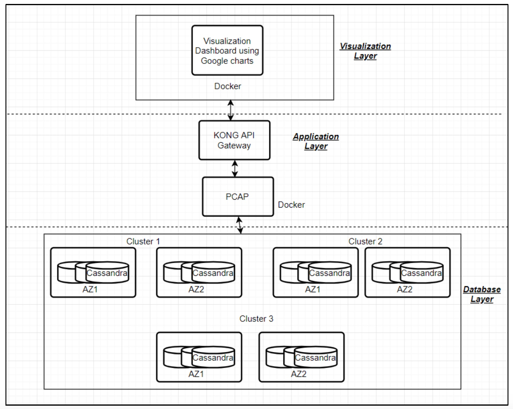

# PCAP

# Architecture

PCAP is a system designed for distributed data stores that adapts automatically in real-time under dynamic network to meet the service level agreement (SLA) while optimizing Consistency/ Availability parameter. The implementation of the algorithm proposed by Rahman., et al (2017) involves designing an ecosystem that will contain clusters of NoSQL databases. Each cluster will have nodes existing in multiple availability zones. The database cluster will be configured to allow data replication across the nodes. Implementation of PCAP will be present in the application layer. All the applications will be containerized using Docker for easy deployment and execution.

Every key-value store provides a read/write API over an asynchronous distributed message-passing network. It has a client-server architecture where data replication is done by the server; it is responsible to keep the data store in a consistent state. Clients, on the other hand, are responsible for the operations (read/ write). PCAP will form an application layer on top of this data storage system. The purpose of a PCAP system is to attain performance close to the unachievable envelope / theoretical consistency-latency tradeoff envelope as mentioned by Rahman., et. al (2017).

YCSB will be used on top of our application layer to evaluate the performance (workload simulation) of the NoSQL database used in the experiment. YCSB adapter for Cassandra is readily available, but if we choose to use Riak for our experiments we will have to develop our own YCSB adapter for the same.

There are few assumptions that are made about the underlying key-value store which are as follows:
1) Every key is being replicated across the cluster on multiple nodes.
2) There exists a master/coordinator node that manages client queries.
3) The existence of a read repair mechanism for reconciling of divergent replicas (eventual consistency).
4) Clocks on all the node servers are synchronized so that global timestamps can be used to detect stale data.

We will be dealing with two types of SLAs to implement PCAP system. A latency SLA meets the desired time deadline for read operations while maximizing the chance of getting fresh results (minimize staleness). An example application using this SLA would be the Amazon shopping cart, which doesn’t want to lose customers due to high latency.

